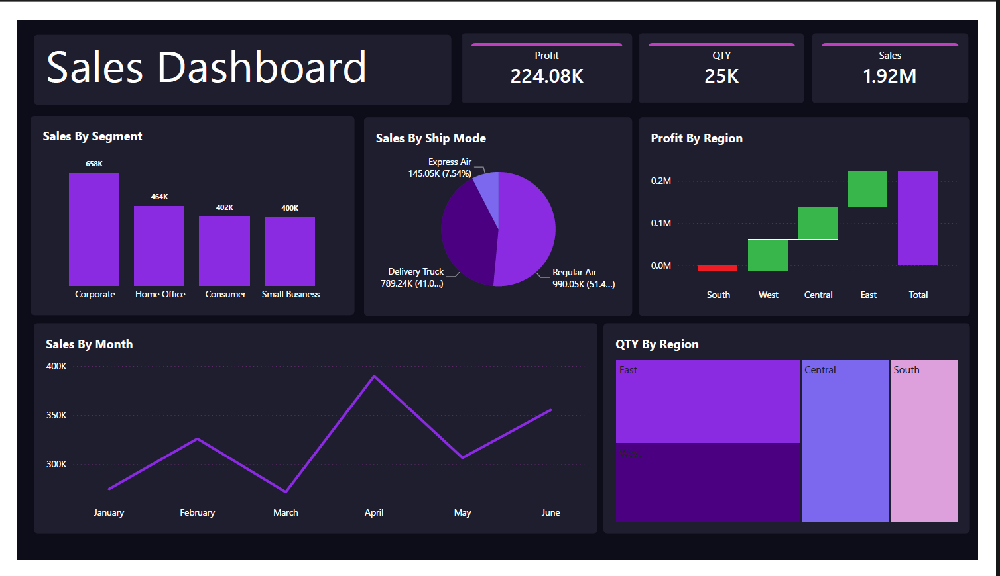
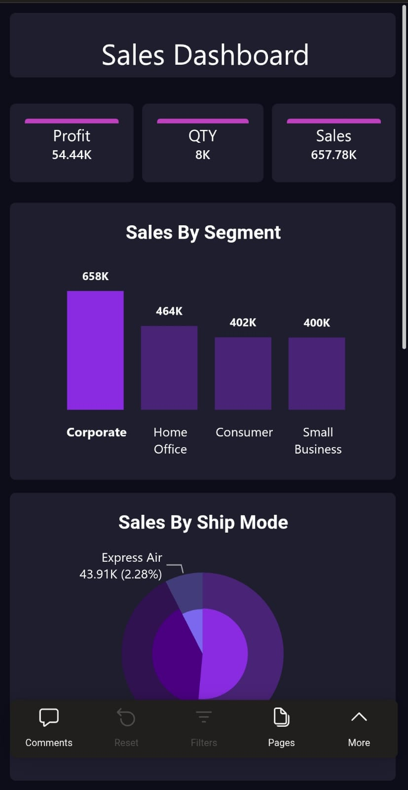

# 📊 Sales Dashboard | Power BI Project

## 📌 Project Overview

This interactive Sales Dashboard was developed using Power BI to analyze sales performance, profitability, customer behavior, shipping methods, and regional trends.

The project transforms raw retail sales data into meaningful business insights through data cleaning, data modeling, DAX calculations, KPI development, and interactive visualizations.

---

## 🖼️ Dashboard Preview

### Desktop Layout

<p align="center">
  
</p>

### Mobile Layout

<p align="center">
  
</p>
---

## 🎯 Project Objectives

* Analyze overall sales performance.
* Monitor business profitability.
* Understand customer segment behavior.
* Evaluate shipping mode performance.
* Compare sales and profit across regions.
* Support data-driven decision making.

---

## 🛠️ Tools & Technologies

* Power BI
* Power Query
* DAX (Data Analysis Expressions)
* Data Modeling
* Interactive Visualizations

---

## 🧹 Data Preparation

### Power Query

The dataset was prepared and transformed using Power Query:

* Data type validation
* Handling missing values
* Data cleaning and standardization
* Data transformation
* Data quality improvements

### Data Modeling

* Built relationships between tables
* Optimized the data model for reporting
* Created calculated columns and measures

### DAX Measures

Key DAX measures were created for:

* Total Sales
* Total Profit
* Quantity Sold
* Profit Margin
* Sales Performance Analysis

---

## 📈 Key Performance Indicators (KPIs)

* 💰 Total Sales
* 📊 Total Profit
* 📦 Quantity Sold
* 📈 Profit Margin

---

## 📊 Dashboard Features

### Sales Analysis

* Sales Trend by Month
* Sales Performance Monitoring

### Customer Analysis

* Sales by Customer Segment

### Shipping Analysis

* Sales by Ship Mode

### Regional Analysis

* Profit by Region
* Quantity Sold by Region

### Interactive Filtering

Users can explore data dynamically through interactive filters and slicers.

---

## 💡 Key Insights

* Corporate customers generated the highest sales.
* The East region achieved the highest profit.
* Regular Air was the most frequently used shipping method.
* Sales performance varied significantly across regions and customer segments.

---

## 🚀 Skills Demonstrated

* Data Cleaning
* Data Transformation
* Power Query
* Data Modeling
* DAX
* KPI Development
* Business Intelligence Reporting
* Dashboard Design
* Data Visualization
* Analytical Thinking

---

## 📁 Repository Structure

```text
.
├── Dashboard
├── Dataset
├── Screenshots
│   └── sales-dashboard.png
└── README.md
```

---

## 🔗 Connect With Me

### Portfolio

🌐 https://naguib5.github.io/

### LinkedIn

💼 https://www.linkedin.com/in/naguib-mousa-a9719b220/

### GitHub

💻 https://github.com/Naguib5

---

⭐ If you found this project useful, feel free to give it a star.
